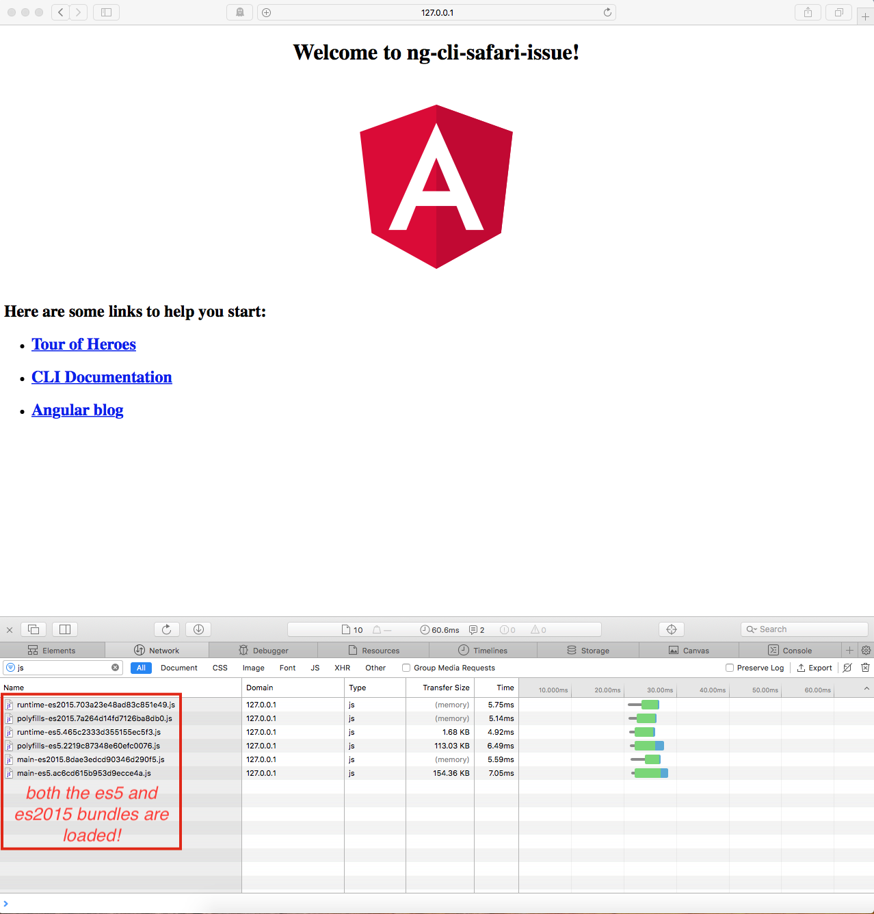

## How to reproduce the issue on Safari (12.1.2)

Run `ng build --prod` and then navigate to the folder `./dist/ng-cli-safari-issue`. Serve this folder over `http` using your favorite http server, for example using the npm packages `http-serve` or `live-serve`. Open the site on Safari and inside the Web Inspector window look at the Network tab about the JS files being loaded. As you see the `ES5` as well as the `ES2015` bundles have been loaded altogether as shown by the screenshot below:

One possible way to remedy this behaviour under Safari seems to be through [through this commit](https://github.com/bvahdat/ng-cli-safari-issue/commit/a82a626538450c1eeb666fd685ab0bc493c0b4f0). That's duplicating all the `script` tags inside a given `index.html` using the `type=module` and `nomodule` attributes. 

# NgCliSafariIssue

This project was generated with [Angular CLI](https://github.com/angular/angular-cli) version 8.1.1.

## Development server

Run `ng serve` for a dev server. Navigate to `http://localhost:4200/`. The app will automatically reload if you change any of the source files.

## Code scaffolding

Run `ng generate component component-name` to generate a new component. You can also use `ng generate directive|pipe|service|class|guard|interface|enum|module`.

## Build

Run `ng build` to build the project. The build artifacts will be stored in the `dist/` directory. Use the `--prod` flag for a production build.

## Running unit tests

Run `ng test` to execute the unit tests via [Karma](https://karma-runner.github.io).

## Running end-to-end tests

Run `ng e2e` to execute the end-to-end tests via [Protractor](http://www.protractortest.org/).

## Further help

To get more help on the Angular CLI use `ng help` or go check out the [Angular CLI README](https://github.com/angular/angular-cli/blob/master/README.md).
